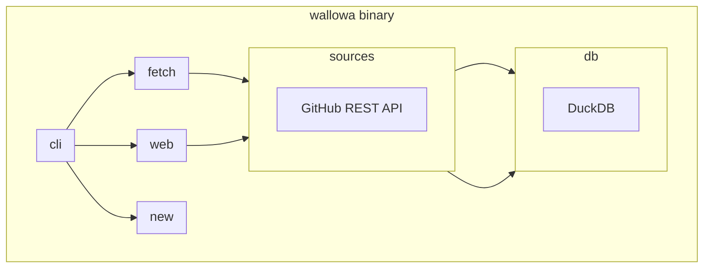
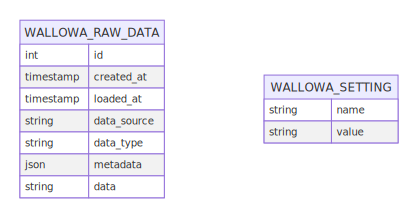
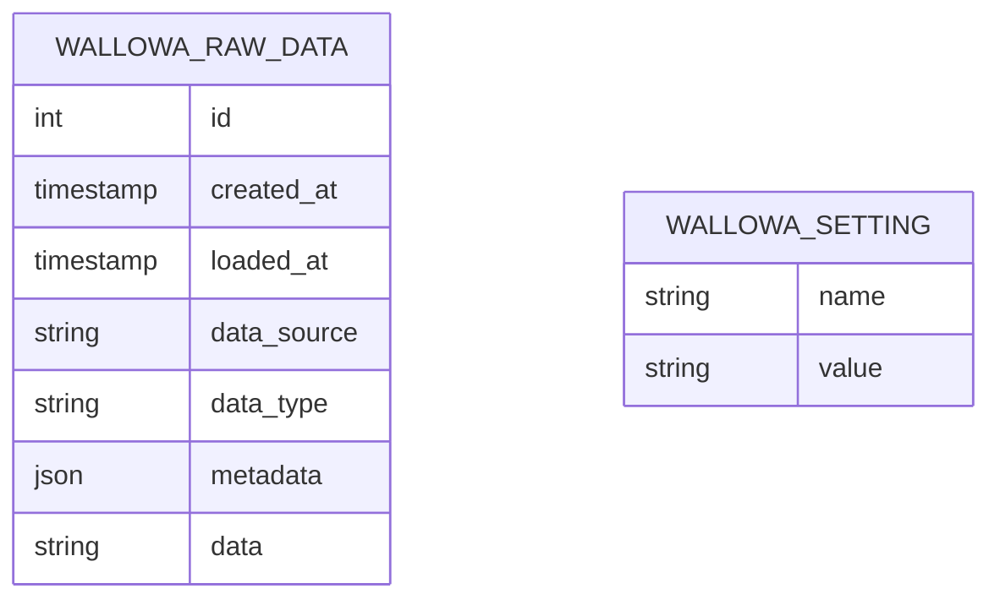

# Architecture

`wallowa` wraps [DuckDB](https://duckdb.org/) with a CLI, web UI, and fetcher to make it quick and easy to gain insight into your SDLC. As much data handling as possible is delegated to DuckDB. The tool is written primarily in [Rust](https://www.rust-lang.org/) and deploys as a single statically linked binary. Check out the [many thanks to the projects that this project depends on](index#thank-you).

There are several components.

::: details View the [MermaidJS](https://mermaid.js.org/) source code for the diagram.

:::

### db

The core of the tool is DuckDB. Database utilities and migration/DDL statements can be found in [src/db.rs](https://github.com/gunrein/wallowa/blob/main/src/db.rs).

#### Queries

Data is queried directly from `wallowa_raw_data` using [DuckDB json extraction functions](https://duckdb.org/docs/extensions/json). See the [src/github/queries.rs](https://github.com/gunrein/wallowa/blob/main/src/github/queries.rs) function for an example of what this looks like in practice.

There is a design tradeoff to querying the raw data directly. The queries themselves are more complicated and expensive to run compared to the data being loaded into normalized tables. However, this leaves a great deal of flexibility to adapt the queries to specific questions that require more of the API payload data. Both styles can be mixed, but for now the reduced complexity approach is being used. You can create views from the more complex queries as a middle ground, too.

#### Entity relationship diagram

::: details View the [MermaidJS](https://mermaid.js.org/) source code for the diagram.
The [MermaidJS](https://mermaid.js.org/) source for the diagram.

:::

### Sources

Sources represent the data sources used to drive insights through queries and charts.

Sources are responsible for providing the fetch, query, and web UI for the data provided by the source.

### Fetch

Data is fetched from data sources and loaded into DuckDB. Each data source is responsible for providing fetch functionality (see [src/github/fetch.rs](https://github.com/gunrein/wallowa/blob/main/src/github/fetch.rs) for an example).

The raw data fetched from a source and the raw JSON payload is saved to the `wallowa_raw_data` table.

The server can be [configured to run the fetcher in the background on a time interval](configuration#fetch-enabled).

### Web UI and server

:::danger
The server should not be exposed directly to the Internet since it has not been hardened for that environment. Run a proxy in front of the server if you choose to expose it to the Internet.
:::

Server-side templates are rendered for the web UI. Typescript/Javascript are used to render charts and for some user interactions.

The core web functionality and types are found in [src/web.rs](https://github.com/gunrein/wallowa/blob/main/src/web.rs). Each source is responsible for providing it's web UI (see [src/github/web.rs](https://github.com/gunrein/wallowa/blob/main/src/github/web.rs) for an example).

### CLI

The CLI provides the commands and options for the [command line interface](cli). The code for the
CLI can be found in [src/cli.rs](https://github.com/gunrein/wallowa/blob/main/src/cli.rs). This includes the ability to generate project scaffolding.
