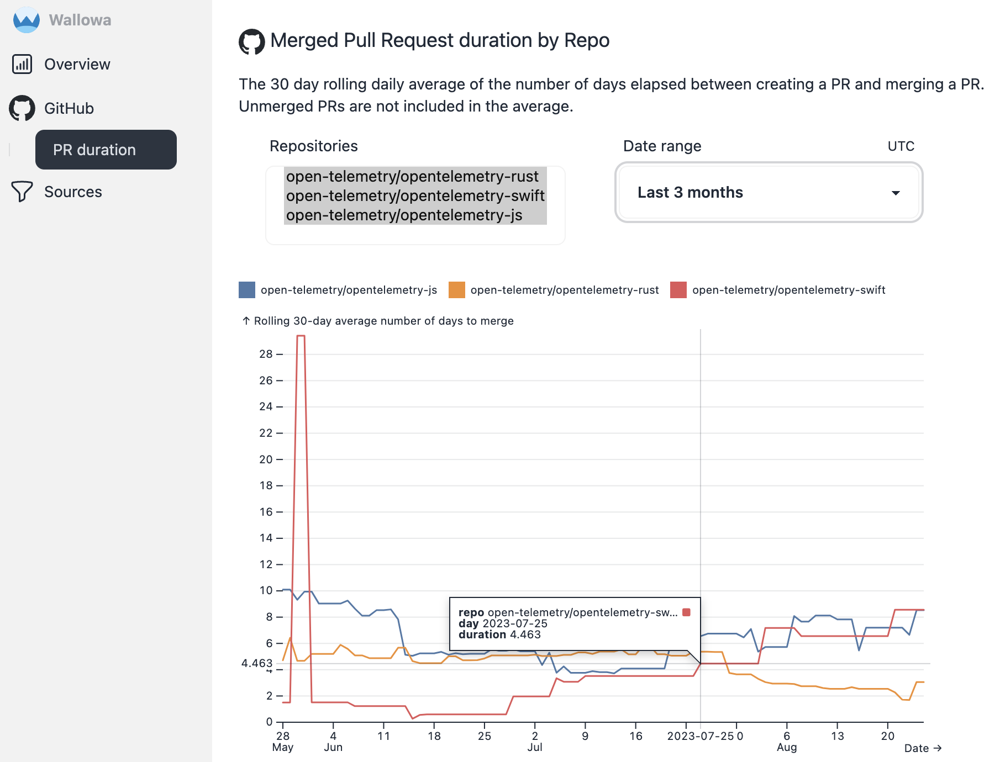

# GitHub data source

Automatically fetch data about your GitHub Pull Request activity.

### Pull Requests (PRs or Pulls) {#pulls}

PRs are fetched from GitHub using the [REST API "List pulls" endpoint](https://docs.github.com/en/rest/pulls/pulls#list-pull-requests). The raw JSON responses can be found in the `wallowa_raw_data` table where `data_source = 'github_rest_api'` and `data_type = 'github_pulls'`.

#### Pull Request duration by repo <Badge type="info" text="v0.1.0" /> {#pull-duration}

The 30 day rolling daily average of the number of days elapsed between creating a PR and merging a PR.
Unmerged PRs are not included in the average.



Here is the query used to gather this data (located in the `merged_pr_duration_rolling_daily_average` function in [src/github/queries.rs](https://github.com/gunrein/wallowa/blob/main/src/github/queries.rs) for context).

```sql
-- merged_pr_duration_rolling_daily_average
-- Duration of merged GitHub Pull Requests, rolling daily average
WITH calendar_day AS (
    -- Generate a series of days so that each day has a rolling average represented
    SELECT CAST(unnest(generate_series(CAST(? AS TIMESTAMP), CAST(? AS TIMESTAMP), interval '1' day)) AS DATE) as "day"
),
pulls AS (
    SELECT
        id,
        "data_source",
        unnest(json_transform_strict("data",
            '[{{
                "url": "VARCHAR",
                "base": {{
                    "repo": {{
                        "name": "VARCHAR",
                        "owner": {{
                            "login": "VARCHAR"
                        }}
                    }}
                }},
                "state": "VARCHAR",
                "created_at": "TIMESTAMP",
                "closed_at": "TIMESTAMP",
                "merged_at": "TIMESTAMP",
                "updated_at": "TIMESTAMP",
                "draft": "BOOLEAN"
            }}]')) AS row,
    FROM wallowa_raw_data
    WHERE "data_source" = 'github_rest_api'
    AND data_type = 'pulls'
),
repos AS (
    {repo_placeholders}
),
calendar_day_repos AS (
    -- Generate a series of days for each repo so that each day+repo has a rolling average represented
    SELECT calendar_day."day", repos.repo FROM calendar_day CROSS JOIN repos
),
latest_deduped_pulls AS (
    SELECT
        row.url AS "url",
        (row.base.repo.owner.login || '/' || row.base.repo.name) AS repo,
        row.created_at AS created_at,
        row.merged_at AS merged_at,
        row.updated_at AS updated_at,
        row_number() OVER (PARTITION BY "url" ORDER BY updated_at DESC) AS row_number
    FROM pulls
    WHERE repo IN (SELECT repo FROM repos)
),
rolling AS (
    SELECT
        repo,
        CAST(created_at AS DATE) AS created_date,
        CAST(merged_at AS DATE) AS merged_date,
        AVG(EPOCH(AGE(merged_at, created_at)) / 86400) OVER thirty AS duration
    FROM latest_deduped_pulls
    WHERE row_number = 1
    AND merged_at NOT NULL
    WINDOW thirty AS (
        PARTITION BY repo
        ORDER BY created_at ASC
        RANGE BETWEEN INTERVAL 30 DAYS PRECEDING
                AND INTERVAL 0 DAYS FOLLOWING)
)
SELECT calendar_day_repos."day" AS "day", rolling.repo, AVG(rolling.duration) AS "duration"
FROM calendar_day_repos ASOF LEFT JOIN rolling ON (calendar_day_repos.repo = rolling.repo AND calendar_day_repos."day" >= rolling.merged_date)
GROUP BY 1,2
ORDER BY 1,2
```

The parameters in order are:

- Start date
- End date
- repo_placeholders is one of:
    - `SELECT DISTINCT (row.base.repo.owner.login || '/' || row.base.repo.name) AS repo FROM pulls` for all repos (no filtering to specific repos)
    - `SELECT unnest([{}])` where `{}` is replaced with a `?,` for each repo to include in the filter, and each repo is added as a query parameter
