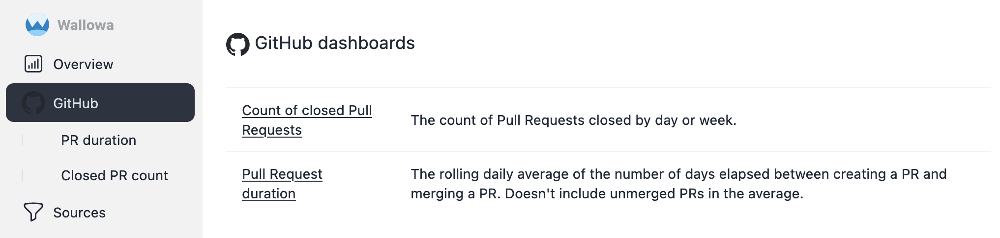

# Web UI

The web UI displays information about your SDLC and the status of data source fetching.
The UI is responsive to screen size so that it is useful on most devices that can run a modern web browser.

### Time picker and filters {#filters}

A time picker and repo filter can be used to display a subset of the data.

The time picker and filters retain their state using [localStorage](https://developer.mozilla.org/en-US/docs/Web/API/Window/localStorage) so that filter state is retained from page to page and session to session.

The repo filter stores which repos are *not* selected so that any new repos that show up in the data set are displayed by default.

### Overview dashboard <Badge type="info" text="v0.1.0" /> {#dashboard}

The overview dashboard is currently sparse with only one chart at the moment, but will show more information as more sources are added.

The dashboard shows small versions of the [Merged Pull Request duration by Repo](#github-pull-duration) and [Count of closed Pull Requests by repo](#github-closed-pr-count) chart.

### Sources <Badge type="info" text="v0.1.0" /> {#sources}

The index of sources lists the status of each source.

#### GitHub <Badge type="info" text="v0.1.0" /> {#github}

The index of GitHub-related charts.

##### Pull Request duration by repo <Badge type="info" text="v0.1.0" /> {#github-pull-duration}

The 30 day rolling daily average of the number of days elapsed between creating a PR and merging a PR.
Unmerged PRs are not included in the average. Details can be found on the
[GitHub sources page](sources/github#pull-duration).

##### Count of closed Pull Requests by repo <Badge type="info" text="v0.2.0" /> {#github-closed-pr-count}

The count of Pull Requests closed by day or week.
Details can be found on the
[GitHub sources page](sources/github#closed-pr-count).

