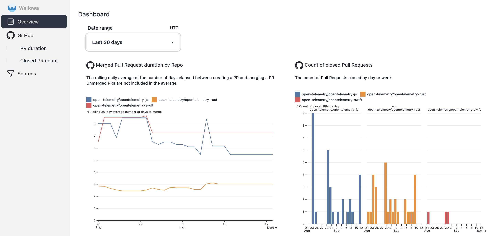
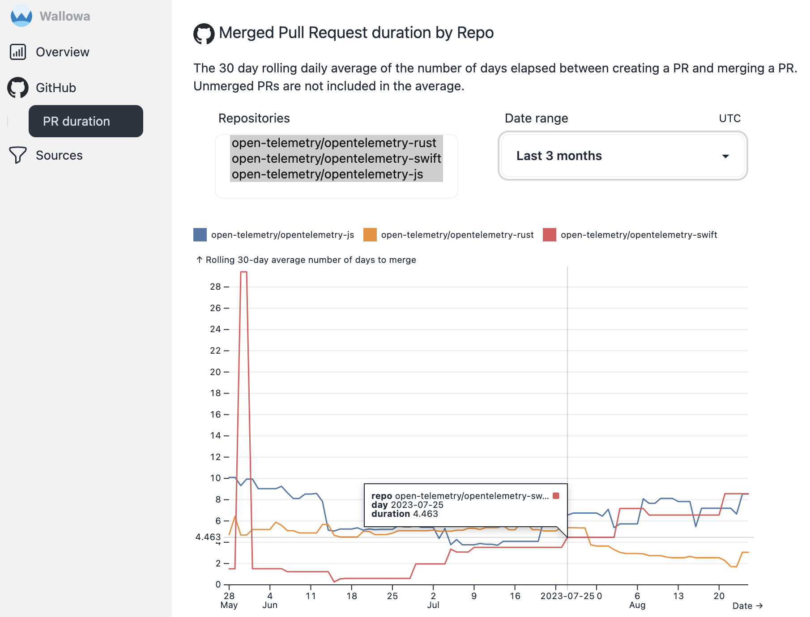

# Web UI

The web UI displays information about your SDLC and the status of data source fetching.
The UI is responsive to screen size so that it is useful on most devices that can run a modern web browser.

## Overview dashboard <Badge type="info" text="v0.1.0" /> {#dashboard}

The overview dashboard is currently sparse with only one chart at the moment, but will show more information as more sources are added.

The dashboard shows a small version of the [Merged Pull Request duration by Repo](#github-pull-duration) chart.

## Sources <Badge type="info" text="v0.1.0" /> {#sources}

The index of sources lists the status of each source.

### GitHub <Badge type="info" text="v0.1.0" /> {#github}

The index of GitHub-related charts.

#### Pull Request duration by repo <Badge type="info" text="v0.1.0" /> {#github-pull-duration}

The 30 day rolling daily average of the number of days elapsed between creating a PR and merging a PR.
Unmerged PRs are not included in the average. Details can be found on the
[GitHub sources page](sources/github#pull-duration).

